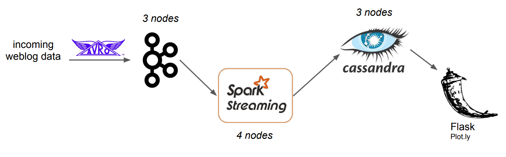

# Project: Web:Log\x

### 1. Synopsis
I built this project during a 3 week phase while participating as a fellow in the Insight Data Engineering Program.

The objective was to build a reliable and fault-tolerant pipeline for real-time analysis of traffic data which are received in forms of web log files coming from a front end service. Various aggregations and calculations are performed on the data stream. The results are stored in a database and visualized on front-end dashboards.

The dashboards show metrics such as:
- total visits per second (streaming time series view)
- unique visits per second (streaming time series view)
- HTTP 4xx status per second to alert for unusual frequencies of client-side errors (streaming time series)
- top 10 IP hosts (by volume and total clicks) by minute (rank chart)

The calculations can be extended to cover further use cases.

### 2. The pipeline

The data is ingested into a Kafka topic to be used as a buffer. Prior to ingestion, the data is serialized using the Avro framework to enforce a schema. A Spark streaming job then consumes the data from the Kafka topic in batches of 5ms and performs the calculations. The time-aggregated results are stored in a Cassandra database. A front-end Flask app is showing real-time streams of the results.

### 3. Performance tuning

### 4. How to set up 

